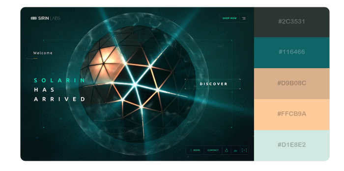
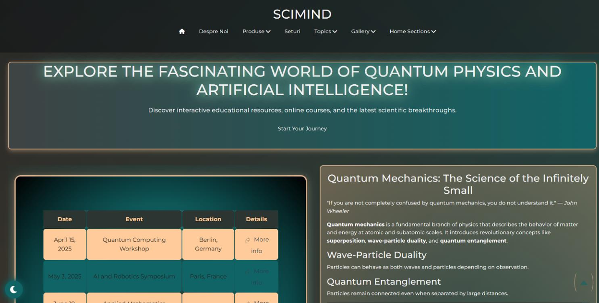
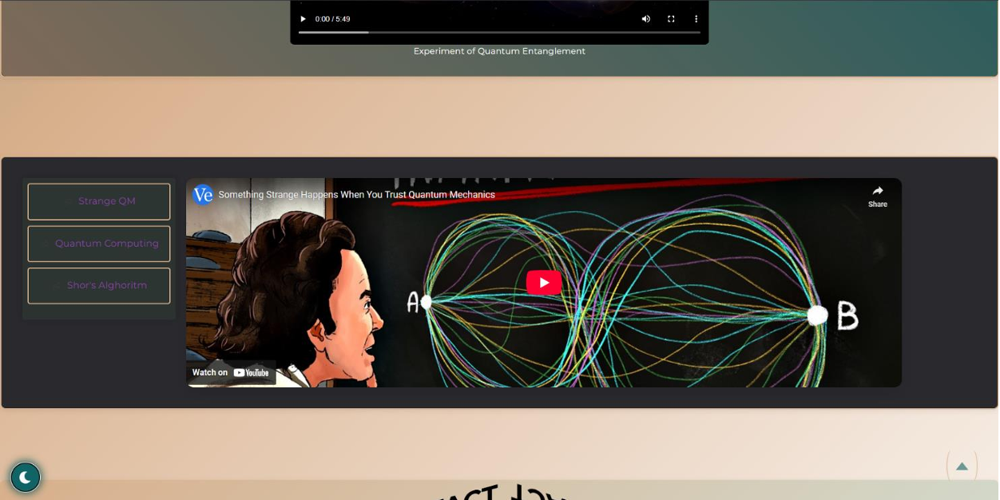
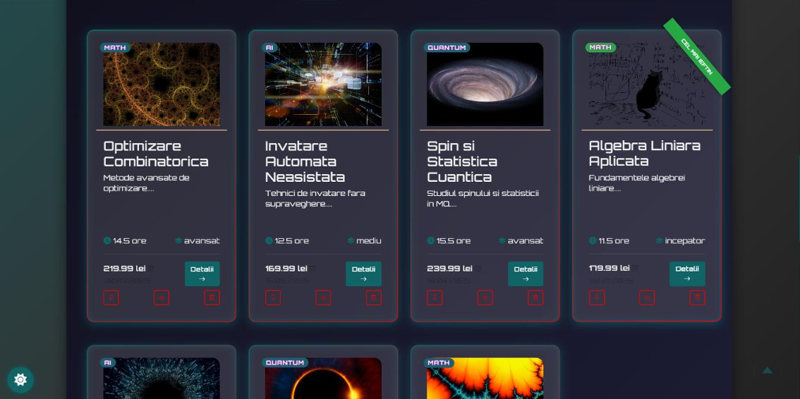
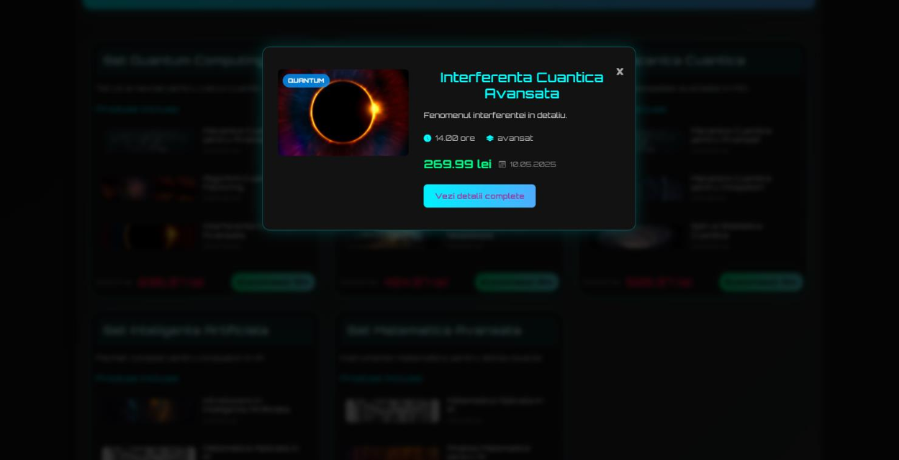
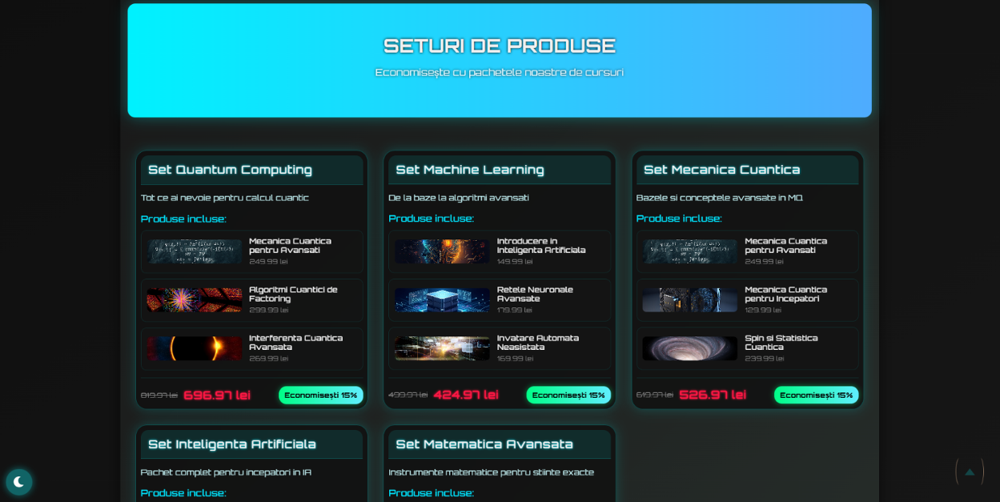
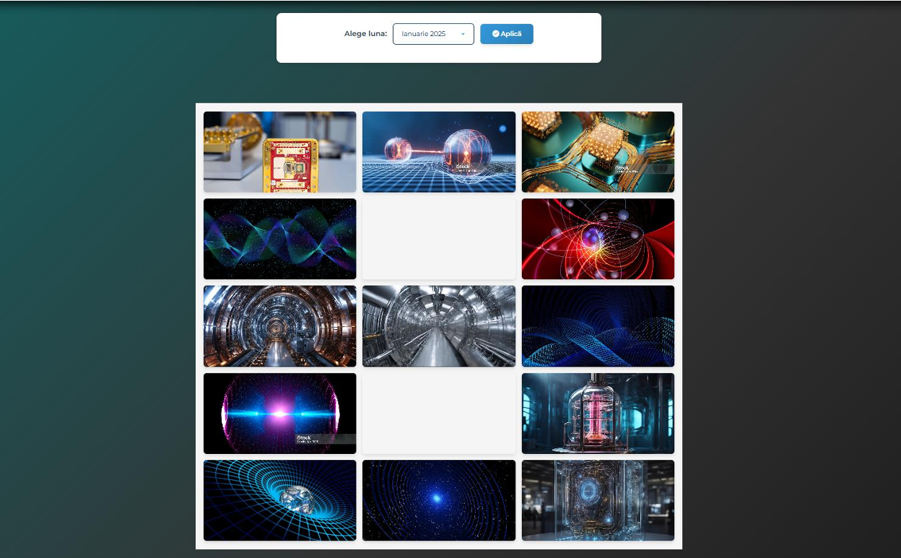

# 🧠 SciMind - Frontiers of Knowledge

*Advanced Education in Quantum Mechanics, Applied Mathematics, and Artificial Intelligence*

---

## 📌 Table of Contents
1. [🎨 Visual Identity](#-visual-identity--chromatic-scheme)
2. [🌌 About SciMind](#-about-scimind)
3. [🔬 Fields of Study](#-fields-of-study)
4. [📸 Visual Gallery](#-visual-gallery)
5. [📚 Products & Resources](#-products--resources)
6. [🎥 Video Library](#-video-library)
7. [🛠 Tech Stack](#-tech-stack)
8. [📜 License](#-license)

---

## 🎨 Visual Identity & Chromatic Scheme

> *"Where the infinite depth of the cosmos meets the sharp precision of code."*

**SciMind** utilizes a high-contrast aesthetic inspired by advanced geometric structures and deep-space interfaces. Our palette combines the darkness of the void with the warmth of illumination.

  

### 🎨 The Palette
| Color | Hex | Usage in SciMind |
| :--- | :--- | :--- |
| **Dark Carbon** | `#2C3531` | Backgrounds, Depth, The Void |
| **Quantum Teal** | `#116466` | Primary Buttons, Links, Tech Accents |
| **Antique Gold** | `#D9B08C` | Secondary Highlights, Borders |
| **Stellar Peach** | `#FFCB9A` | Active States, Notifications, "Solar" Energy |
| **Pale Cyan** | `#D1E8E2` | Primary Typography, Clarity |

---

## 🌌 About SciMind

> *"Knowledge is the bridge to the future."*

**SciMind** is a premium educational platform dedicated to promoting knowledge in cutting-edge fields. In a world dominated by rapid information, we offer **depth**. The site serves as a central hub for students, researchers, and enthusiasts, providing access to:

* ⚛️ **Educational Resources:** Articles and courses on the mechanics of the universe.
* 🛍️ **Dedicated Shop:** Specialized books, experimental kits, and themed products.
* 🤖 **AI Integration:** Virtual assistants to explain complex concepts.
* 📊 **Visual Mathematics:** Graphs and simulations for abstract concepts.

Our goal is to demystify complex subjects and inspire scientific curiosity through up-to-date, relevant content for those interested in the frontiers of modern science.

---

## 🔬 Fields of Study

| ⚛️ Quantum Mechanics | 📐 Applied Mathematics | 🤖 Artificial Intelligence |
| :--- | :--- | :--- |
| Exploration of the subatomic world, quantum entanglement, and wave-particle duality. | Modeling reality through equations, advanced statistics, and differential calculus. | Neural networks, Machine Learning, and ethics in the new digital age. |

---

## 📸 Visual Gallery

A visual tour of the platform, educational materials, and the integrated shop.

### 1. User Interface
|  |  |
|:--:|:--:|
| *Main Page - The Knowledge Portal* | *User Dashboard & Progress* |

### 2. Educational Modules
|  |  |
|:--:|:--:|
| *Interactive Module: Quantum Physics* | *Complex Mathematical Visualizations* |

### 3. SciMind Shop
|  |  |
|:--:|:--:|
| *Store Overview* | *Product Detail: Specialized Books* |

### 4. Events & Community
|  |
|:--:|
| *Scientific Events Calendar* |

---

## 📚 Products & Resources

SciMind offers a diverse range of materials to deepen your understanding.

| Category | Product Type | Description |
| :--- | :--- | :--- |
| **Library** | 📘 Physical Books/E-books | Physics treatises, math manuals, AI guides. |
| **Merchandise** | 👕 Apparel & Accessories | T-shirts with formulas, themed mugs, scientific posters. |
| **Education** | 🎓 Video Courses | Lecture series from industry experts. |
| **Software** | 💾 Scripts & Models | Pre-trained AI models and Jupyter notebooks. |

---

## 🛠 Tech Stack

The project is built using a modern stack, optimized for performance and scalability.

* **Frontend:** React.js / Next.js (for fast rendering)
* **Styling:** Tailwind CSS (modern and responsive design)
* **Backend:** Node.js / Python (for scientific data processing)
* **Database:** PostgreSQL / MongoDB
* **AI Integration:** OpenAI API / TensorFlow

---

## 📜 License

**MIT License**

Copyright (c) 2025 MANEA FLORIN

Permission is hereby granted, free of charge, to any person obtaining a copy
of this software and associated documentation files (the "Software"), to deal
in the Software without restriction, including without limitation the rights
to use, copy, modify, merge, publish, distribute, sublicense, and/or sell
copies of the Software, and to permit persons to whom the Software is
furnished to do so, subject to the following conditions:

The above copyright notice and this permission notice shall be included in all
copies or substantial portions of the Software.

THE SOFTWARE IS PROVIDED "AS IS", WITHOUT WARRANTY OF ANY KIND, EXPRESS OR
IMPLIED, INCLUDING BUT NOT LIMITED TO THE WARRANTIES OF MERCHANTABILITY,
FITNESS FOR A PARTICULAR PURPOSE AND NONINFRINGEMENT. IN NO EVENT SHALL THE
AUTHORS OR COPYRIGHT HOLDERS BE LIABLE FOR ANY CLAIM, DAMAGES OR OTHER
LIABILITY, WHETHER IN AN ACTION OF CONTRACT, TORT OR OTHERWISE, ARISING FROM,
OUT OF OR IN CONNECTION WITH THE SOFTWARE OR THE USE OR OTHER DEALINGS IN THE
SOFTWARE.
